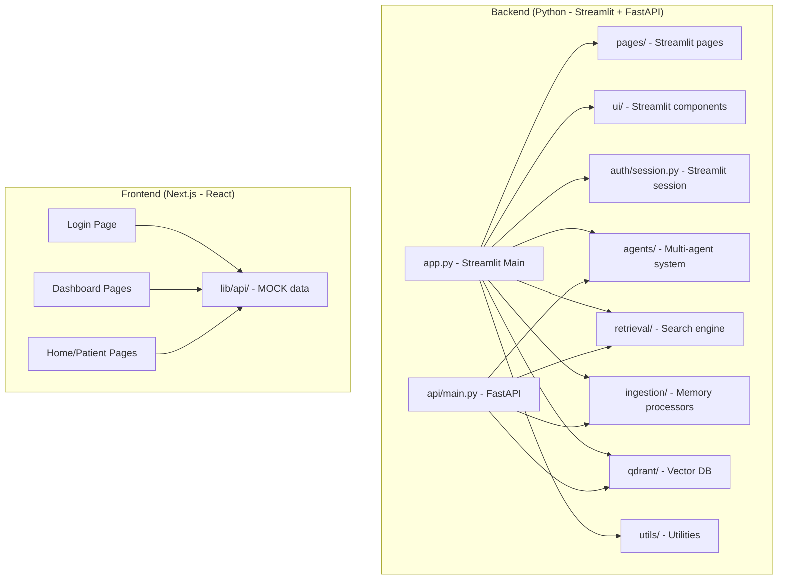
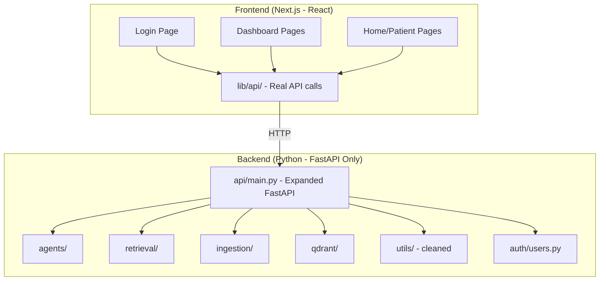

# LifeLens: Backend Streamlit → FastAPI + React Migration

## Goal

Migrate the LifeLens backend from a Streamlit-powered monolith to a **clean FastAPI API server** that serves the existing React/Next.js frontend. Remove all Streamlit-specific code from the backend while preserving all core business logic (agents, retrieval, ingestion, Qdrant, etc.)

## Current Architecture

## Target Architecture

---

## User Review Required

> [!IMPORTANT]
> **Authentication**: The current backend uses JWT tokens via `api/main.py`. The React frontend also uses JWT via zustand persisted store. I'll keep this pattern — the login API on the backend returns a JWT, and the frontend stores it and attaches it to every request.

> [!IMPORTANT]
> **Default Users**: The backend default users are `patient1/patient123`, `caretaker1/care123`, `family1/family123`. The frontend currently uses different mock credentials (`alice/password`, `bob/password`, `carol/password`). I'll update the frontend's demo credentials to match the backend.

> [!WARNING]
> **Qdrant dependency**: The backend requires a running Qdrant instance and valid API keys in `.env`. The frontend will no longer work with mock data — it will require the backend to be running.

---

## Proposed Changes

### Phase 1: Expand the FastAPI Backend

The existing `api/main.py` only has ~6 endpoints (login, search, memories, create memory, upload image, upload audio). The React frontend needs many more. 

#### [MODIFY] [main.py](file:///c:/Users/Pranav/Desktop/lifelens/backend/lifelens/api/main.py)

Add the following new endpoints to serve all frontend pages:

**Auth & Users:**
- `POST /api/auth/register` — User registration
- `GET /api/auth/patients` — List all patients (for caretaker/family patient selector)

**Memories & Chat:**
- `POST /api/chat` — Agentic/legacy chat flow (wraps `orchestrator.run_agentic_flow`)  
- `POST /api/memory/upload/text` — Text memory creation with location & milestone support

**Dashboard Analytics (caretaker):**
- `GET /api/dashboard/stats/{patient_id}` — Memory stats (total count, streak, type counts, daily counts)
- `GET /api/dashboard/mood/{patient_id}` — Mood data (distribution, trend over time, visitor correlations)
- `GET /api/dashboard/insights/{patient_id}` — Agent-generated insights

**Medications:**
- `GET /api/medications/{patient_id}` — List active medications
- `POST /api/medications` — Add medication
- `PUT /api/medications/{med_id}` — Update medication
- `DELETE /api/medications/{med_id}` — Deactivate medication  
- `GET /api/medications/{patient_id}/events` — Today's dose events
- `POST /api/medications/dose` — Mark dose taken/skipped
- `GET /api/medications/{patient_id}/adherence` — Adherence data (7 day)

**Triggers:**
- `GET /api/triggers/{patient_id}` — Active triggers
- `POST /api/triggers/{trigger_id}/dismiss` — Dismiss trigger
- `POST /api/triggers/test-alert` — Test notification

**Family Portal:**
- `GET /api/family/summary/{patient_id}` — AI-generated family summary
- `GET /api/family/requests/{patient_id}` — Memory requests
- `POST /api/family/requests` — Submit a memory request
- `PUT /api/family/requests/{request_id}` — Update request status
- `GET /api/family/milestones/{patient_id}` — Milestone memories
- `GET /api/family/messages/{patient_id}` — Message board entries
- `POST /api/family/messages` — Post a message

**AI Suggestions:**  
- `GET /api/suggestions/{patient_id}` — Agent suggestions/recommendations

**Map & Wearable:**
- `GET /api/map/memories/{patient_id}` — Memories with location data  
- `GET /api/wearable/data/{patient_id}` — Wearable/health data

---

### Phase 2: Remove Streamlit-Specific Code from Backend

#### [DELETE] Streamlit Files (these are purely UI/Streamlit):
- `backend/lifelens/app.py` — Main Streamlit app (986 lines of Streamlit UI)
- `backend/lifelens/pages/dashboard.py` — Streamlit caretaker dashboard
- `backend/lifelens/pages/family_portal.py` — Streamlit family portal
- `backend/lifelens/pages/map.py` — Streamlit map page
- `backend/lifelens/pages/medications.py` — Streamlit medication page  
- `backend/lifelens/pages/wearable.py` — Streamlit wearable page
- `backend/lifelens/auth/session.py` — Streamlit session management (uses `st.session_state`)
- `backend/lifelens/ui/components.py` — Streamlit CSS loader
- `backend/lifelens/ui/agent_trace.py` — Streamlit agent trace panel
- `backend/lifelens/ui/medication_components.py` — Streamlit medication UI
- `backend/lifelens/ui/mood_components.py` — Streamlit mood UI
- `backend/lifelens/ui/trigger_components.py` — Streamlit trigger UI
- `backend/lifelens/ui/styles.css` — Streamlit CSS
- `backend/lifelens/utils/styles.py` — Streamlit CSS injection
- `backend/lifelens/utils/display.py` — Streamlit memory display

#### [KEEP] Core Business Logic (no Streamlit dependencies):
- `backend/lifelens/agents/` — All 19 agent modules ✅
- `backend/lifelens/qdrant/` — Qdrant client & schema ✅
- `backend/lifelens/retrieval/` — Search engine, reasoning, time parser ✅
- `backend/lifelens/ingestion/` — Image, audio, text, video processors ✅
- `backend/lifelens/orchestrator.py` — Multi-agent orchestrator ✅
- `backend/lifelens/config.py` — Configuration ✅
- `backend/lifelens/auth/users.py` — User auth (no Streamlit import) ✅
- `backend/lifelens/utils/agent_utils.py` ✅
- `backend/lifelens/utils/ai_prompts.py` ✅
- `backend/lifelens/utils/analytics.py` ✅
- `backend/lifelens/utils/export.py` ✅
- `backend/lifelens/utils/file_helpers.py` ✅
- `backend/lifelens/utils/geocoding.py` ✅
- `backend/lifelens/utils/logging.py` ✅
- `backend/lifelens/utils/medication_utils.py` ✅
- `backend/lifelens/utils/memory_graph.py` ✅
- `backend/lifelens/utils/memory_requests.py` ✅
- `backend/lifelens/utils/ntfy_notifications.py` ✅
- `backend/lifelens/utils/reminders.py` ✅
- `backend/lifelens/utils/trigger_agent.py` ✅
- `backend/lifelens/utils/trigger_storage.py` ✅
- `backend/lifelens/utils/tts.py` ✅
- `backend/lifelens/utils/voice_commands.py` ✅
- `backend/lifelens/scripts/` — Background services ✅
- `backend/lifelens/notifications.py` ✅

#### [MODIFY] [requirements.txt](file:///c:/Users/Pranav/Desktop/lifelens/backend/lifelens/requirements.txt)
- Remove `streamlit`, `streamlit-folium`, `altair`, `blinker`
- Keep everything else

---

### Phase 3: Connect React Frontend to Real API

#### [MODIFY] [client.ts](file:///c:/Users/Pranav/Desktop/lifelens/frontend/src/lib/api/client.ts)
- Change `baseURL` from `/api` to `http://localhost:8000/api` (or use env variable)
- Add response interceptor for 401 → redirect to login

#### [MODIFY] [auth.ts](file:///c:/Users/Pranav/Desktop/lifelens/frontend/src/lib/api/auth.ts)
- Replace mock `loginUser()` with real `POST /api/auth/login` call
- Replace mock `registerUser()` with real `POST /api/auth/register` call
- Map backend response shape to frontend `User` type

#### [MODIFY] [memories.ts](file:///c:/Users/Pranav/Desktop/lifelens/frontend/src/lib/api/memories.ts)
- Replace mock `getMemories()` → `GET /api/memories/{patient_id}`
- Replace mock `searchMemories()` → `POST /api/search`
- Replace mock `createMemory()` → `POST /api/memory/create`
- Replace mock `askLifeLens()` → `POST /api/chat`
- Add `uploadImage()` → `POST /api/upload/image`
- Add `uploadAudio()` → `POST /api/upload/audio`

#### [MODIFY] [medications.ts](file:///c:/Users/Pranav/Desktop/lifelens/frontend/src/lib/api/medications.ts)
- Replace all mock calls with real API calls

#### [MODIFY] [triggers.ts](file:///c:/Users/Pranav/Desktop/lifelens/frontend/src/lib/api/triggers.ts)
- Replace all mock calls with real API calls

#### [NEW] [dashboard.ts](file:///c:/Users/Pranav/Desktop/lifelens/frontend/src/lib/api/dashboard.ts)
- `getDashboardStats()` → `GET /api/dashboard/stats/{patient_id}`
- `getMoodData()` → `GET /api/dashboard/mood/{patient_id}`
- `getAgentInsights()` → `GET /api/dashboard/insights/{patient_id}`

#### [NEW] [family.ts](file:///c:/Users/Pranav/Desktop/lifelens/frontend/src/lib/api/family.ts)
- `getFamilySummary()`, `getRequests()`, `submitRequest()`, `getMessages()`, `postMessage()`

#### [MODIFY] [session-store.ts](file:///c:/Users/Pranav/Desktop/lifelens/frontend/src/lib/store/session-store.ts)
- Update `login()` to map backend user response correctly

#### [MODIFY] Login page — Update demo credentials to match backend defaults

#### [MODIFY] [next.config.ts](file:///c:/Users/Pranav/Desktop/lifelens/frontend/next.config.ts)
- Add API proxy rewrite: `/api/:path*` → `http://localhost:8000/api/:path*`

#### [KEEP] — `mock-data.ts` will remain as a fallback reference but won't be imported by API functions

---

### Phase 4: Startup Scripts

#### [MODIFY] [start_api_server.bat](file:///c:/Users/Pranav/Desktop/lifelens/backend/start_api_server.bat)
- Update to point to the expanded FastAPI server

#### [NEW] `start_dev.bat` (root level)
- Starts both backend (FastAPI on :8000) and frontend (Next.js on :3000)

---

## Open Questions

> [!IMPORTANT]
> **Wearable & Map data**: The current backend `pages/wearable.py` and `pages/map.py` contain Streamlit-specific code but also have some data fetching logic. Should I extract the data-fetching parts into new API endpoints, or are these pages currently using mock/dummy data in the React frontend and can stay that way for now?

> [!IMPORTANT]
> **Mood Analysis background service**: The backend has `scripts/scheduled_mood_analysis.py` that runs as a background service. Should this continue to run separately, or do you want me to integrate periodic mood analysis into the FastAPI server startup?

---

## Verification Plan

### Automated Tests
1. Start the FastAPI backend: `python -m uvicorn lifelens.api.main:app --host 0.0.0.0 --port 8000`
2. Test critical endpoints with `curl`:
   - `POST /api/auth/login` with default credentials
   - `GET /api/memories/patient_1`
   - `POST /api/chat`
   - `GET /api/dashboard/stats/patient_1`
   - `GET /api/medications/patient_1`
   - `GET /api/triggers/patient_1`
3. Start the Next.js frontend: `npm run dev` 
4. Browser test: Login flow → Dashboard → Chat → Memory Lane

### Manual Verification
- Full login/logout cycle
- Chat with agentic mode (requires Qdrant + GROQ/Gemini keys)
- Verify all pages render without falling back to mock data
